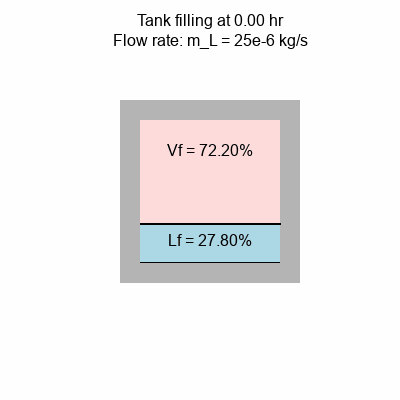

# Proyecto: Simulación de transferencia de calor transiente durante la carga y descarga de amoníaco verde refrigerado en tanques cilíndricos verticalmente orientados.

## Introducción


## Metodología

Antes de realizar la implementación computacional, se desarrolla matemáticamente el problema utilizando balances de energía, de masa y ecuaciones de transferencia de calor

### Carga de amoníaco

Para simular la carga de amoníaco, se realizan balances de masa y energía, además de un análisis de la transferencia de calor sobre el vapor presente en el tanque.


**Definiciones**


- $\dot{m}_{L}$: Flujo másico de entrada al estanque $[kg/s]$.
- $\dot{B}_{L}$: Tasa de evaporación de líquido $[kg/s]$.
- $\dot{B}$: Tasa de *Boil-off gas* $[kg/s]$.
- $\dot{Q}_{L} = U_L A_L (T_{air} - T_L)$: Ingreso de calor desde el exterior hacia la fase líquida $[W]$.
- $\dot{Q}_{V} = U_V (1 - \eta_W) A_V (T_{air} - \overline{T}_v)$: Ingreso de calor desde el exterior hacia la fase de vapor $[W]$
- $\dot{Q}_{b}$: Ingreso de calor desde el fonde del tanque debido a una fuente externa $[W]$.
- $\dot{Q}_{VL} = \frac{\pi d_i^2}{4} \overline{k}_v \frac{\partial T}{\partial z}|_{z = 0}$: Ingreso de calor hacia el líquido debido al vapor sobrecalentado mediante conducción $[W]$.
- $\dot{Q}_{V,w} = \eta_w \dot{Q}_{V}$: Calor del exterior dirigido hacia el vapor que es conducido hacia la interfaz líquido vapor $[W]$.

**Balance de masa en el líquido del tanque**

$$
\frac{d}{dt}(\rho_L V_L) = \dot{m}_L - \dot{B}_L
$$

**Balance de energía en el líquido del tanque**

$$
\dot{Q}_{bottom} + \dot{Q}_{L} + \dot{Q}_{V,w} + \dot{Q}_{VL} + \dot{m}_L h_L - \dot{B}_L h_v = \frac{d}{dt}(\rho_L V_L h_L)
$$

Reemplazando la ecuación del balance de masa en el balance de energía, y considerando que en un proceso isobárico tanto la presión como la entalpía son constantes, se tiene:

$$
\dot{Q}_{bottom} + \dot{Q}_{L} + \dot{Q}_{V,w} + \dot{Q}_{VL} + \dot{m}_L h_L - \dot{B}_L h_v = h_L (\dot{m}_L - \dot{B}_L)
$$

$$
\dot{Q}_{bottom} + \dot{Q}_{L} + \dot{Q}_{V,w} + \dot{Q}_{VL} + - \dot{B}_L h_v = - \dot{B}_L h_L
$$

$$
\dot{B}_L = \frac{\dot{Q}_{bottom} + \dot{Q}_{L} + \dot{Q}_{V,w} + \dot{Q}_{VL}}{h_v - h_L}
$$

Así, de esta forma se vuelve a reemplazar en el balance de masas y se obtiene:

$$
\frac{dV_L}{dt} = \frac{\dot{m}_L}{\rho_L} - \frac{\dot{Q}_{bottom} + \dot{Q}_{L} + \dot{Q}_{V,w} + \dot{Q}_{VL}}{\rho_L(h_v - h_L)}
$$

**Transferencia de calor 1D transiente en el vapor**

Para modelar la temperatura del vapor, se utiliza la ecuación de transferencia de calor 1D (asumiendo que sólo varía verticalmente), considerando términos difusivos, advectivos y de fuente.

$$
\frac{\partial T_v}{\partial t} = \frac{k_v}{\rho_v c_{p_v}} \frac{\partial ^2 T_v}{\partial z^2} - v_z \frac{\partial T_v}{\partial z} + \frac{\dot{S}_{gen}}{\rho_v c_{p_v}}
$$

La cual posee las siguientes condiciones de borde:

$$
T_v(z,t=0)=T_L
$$

$$
T_v(z=0, t) = T_L
$$

$$
k_v \frac{\partial T_v}{\partial z}(z=l_V,t)=0
$$

Las dos ecuaciones son resueltas utilizando el método ```solve_ivp``` proveniente de ```scipy.optimize```, utilizando como método de resolución el RK45.

### Descarga de Amoniaco

Para la descarga de amoniaco se utiliza la misma ecuación que para la carga de amoniaco pero para flujos negativos.

## Resultados

Los principales resultados obtenidos para esta simulación son los siguientes:

1) ***Boil-off gas rate***: Mientras mayor es el flujo másico de entrada, mayor es el flujo másico de gas evacuado. En los siguientes gráficos se muestra tanto el *boil-off gas rate* $\dot{B}$ en función del tiempo como la relación entre $\dot{B}$ y $\dot{m}_L$


2) Evaporación de líquido: Se puede ver que para flujos másicos positivos, la tasa de evaporación de líquido aumenta con el tiempo. Por su parte, para flujos másicos negativos, la tasa de evaporación tiende a disminuir a medida que transcurre el tiempo. Sin embargo, la relación entre la tasa de evaporación y la masa de líquido dentro del tanque es mayor mientras más grande es el flujo másico de descarga.


La disminución de tasa de evaporación se debe a que esta es proporcional a la transferencia de calor, la cual depende de la altura de líquido. Mientras menor nivel de líquido haya, menor es la transferencia de calor total y por ende menor la tasa de evaporación.


En el siguiente gif se muestra un ejemplo del llenado de llenado de un tanque de $6.75\;[L]$ con un flujo másico de entrada de $25\cdot10^{-6}\;[kg/s]$



## Conclusiones

Es sabido que Chile es uno de los países con mayor potencial de energías renovables. Actualmente existen grandes proyectos de producción de amoniaco verde, entre los cuales destaca el proyecto amoniaco verde en Magallanes, el proyecto Volta para una planta de amoniaco e hidrógeno verde, el proyecto HNH ENERGY de producción y exportación de amoniaco verde [3]. Es crucial que el país sea pionero en lo que a desarrollo tecnológico se refiere para ser líderes de la transición energética mundial hacia energías limpias. 

Este tipo de simulaciones son importantes ya que ayudan a los proyectos que están en calificación a dimensionar sus equipos, producción y funcionamiento. Esta simulación demuestra que si se desease aumentar la producción de amoniaco (y por ende, que aumente el flujo másico hacia los tanques), se debe considerar un costo mayor tanto de operación como de inversión de los equipos recuperadores del *boil-off gas*, por lo que en base a este tipo de simulaciones se puede determinar la producción óptima de amoniaco en la planta. Este modelo, si bien posee algunos supuestos, es crucial para desarrollar un buen dimensionamiento de los equipos necesarios para la planta, siendo una oportunidad de innovación para poder combatir estas dificultades que se presentan.

## Explicación del código implementado

**Modificación en CryoEvap**

- Se modifica el método ```__init__``` de la clase ```Tank``` del archivo ```CryoEvap/cryoevap/storage_tanks/tank.py```. Ahora, tiene como argumento el flujo másico de entrada $\dot{m}_{L}$.

- Se modifica la clase ```Tank``` del archivo ```CryoEvap/cryoevap/storage_tanks/tank.py``` en el método ```sys_liq_volume```. Ahora, en vez de retornar ```-1 / self.cryogen.rho_L * (Q_L_tot/dH_LV)``` (tasa de cambio del volumen del líquido en ausencia de flujo másico de entrada), retorna ```-1 / self.cryogen.rho_L * (Q_L_tot/dH_LV) + (self.m_L / self.cryogen.rho_L)``` (la tasa de cambio del volumen actualizada)


**Implementaciones adicionales**

- En ```ammonia_test.ipynb``` se ejecutan simulaciones para distintos flujos másicos. En ese archivo se definen los parámetros con los cuales se trabaja junto con su justificación.
- En ```all_ammonia_graphs.ipynb.ipynb``` se muestran varios gráfico de las simulaciones realizadas en ```ammonia_test.ipynb```. Además, se incluye una interpretación de los resultados junto con el impacto esperado en Chile.
- En ```pygame_simulation.ipynb``` se muestra una animación del llenado del tanque.

## Referencias

[1] Huerta, F., & Vesović, V. (2019). A realistic vapour phase heat transfer model for the weathering of LNG stored in large tanks. Energy, 174, 280-291. https://doi.org/10.1016/j.energy.2019.02.174

[2] Huerta, F., & Vesović, V. (2025). CryoEvap: An open-source software to simulate the evaporation of cryogenic liquids in vertically orientated storage tanks. SoftwareX, 30, 102099. https://doi.org/10.1016/j.softx.2025.102099

[3] Servicio de Evaluación Ambiental. (s. f.). Sistema de Evaluación de Impacto Ambiental (SEIA). Gobierno de Chile. Recuperado de https://seia.sea.gob.cl